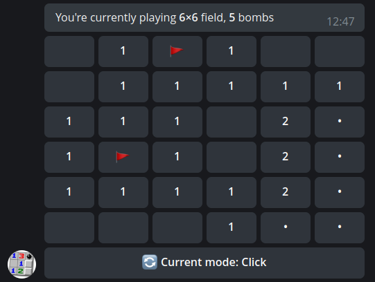

# Bombsweeper Bot

 
  

This is simple minesweeper-like Telegram game. 
You need to open all "free" squares and put flags on squares 
with bombs on them. If you open a cell with a bomb, the game is over.

## Used technology
* Python 3.9;
* aiogram 3.x (Telegram Bot framework);
* Docker and Docker Compose (containerization);
* PostgreSQL (database);
* Redis (persistent storage for some ongoing game data);
* SQLAlchemy (working with database from Python);
* Alembic (database migrations made easy);
* Docker images are built with buildx for both amd64 and arm64 architectures.

## Installation

Create a directory of your choice, let's say `/opt/bombsweeper`. Inside it, make 3 directories for bot's data:  
`mkdir -p {pg/init,pg/data,redis/config,redis/data}`

Grab `docker-compose-example.yml`, rename it to `docker-compose.yml` and put it to `/opt/bombsweeper`.

Grab `redis.example.conf` file, rename it to `redis.conf` and put into `redis/config` directory. 
Change its values for your preference.

Grab `pg_init_user.sh`, put it into `pg/init` and make executable (add "x" flag). Open it, replace  
`myuser` and `mydb` values with your own. Save file.

Grab `env_dist` file, rename it to `.env` and put it next to your `docker-compose.yml`, open 
and fill the necessary data. Pay attention to POSTGRES_DSN value, sync it with `pg_init_user` values.

Finally, start your bot with `docker-compose up -d` command.
